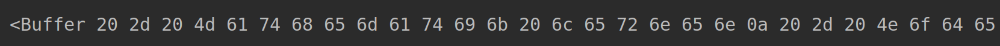
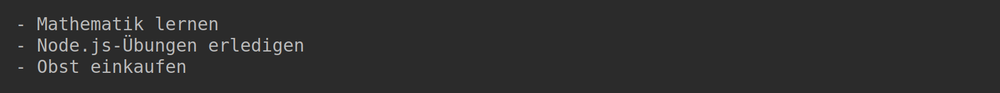
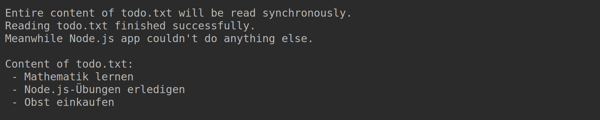
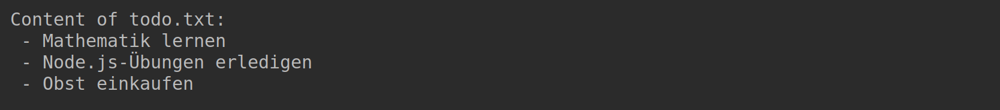
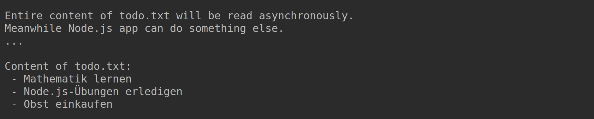
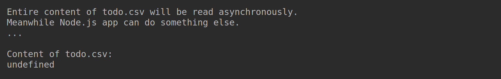
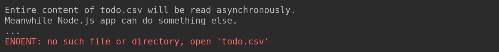
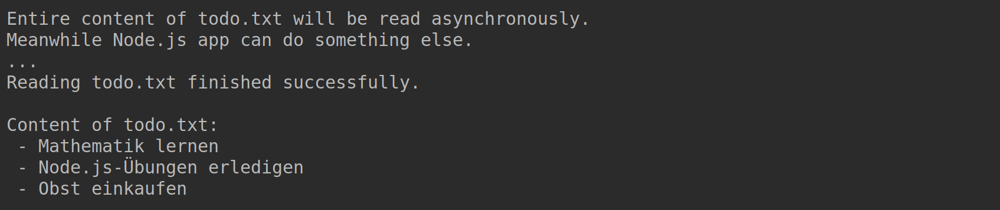
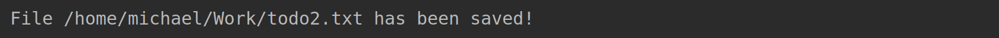

# Todo List

## Task 1: Read File Synchronously

Erstellen Sie die JavaScript-Datei `readSync.ts`, die den gesamten Inhalt der vorhandenen Datei `todo.txt` **synchron** einliest. Die *Node.js* App ist daher während des Zugriffs auf die Datei blockiert und kann in dieser Zeit keine anderen Operationen durchführen.

Importieren Sie hierfür die Funktion `readFileSync` aus dem Modul `fs`. Weisen Sie anschließend den Dateinamen einer Konstanten mit der Bezeichnung `fileName` zu. Um nun den gesamten Dateiinhalt synchron einzulesen, müssen Sie folgende Funktion aufrufen:

```javascript
let content: Buffer = readFileSync(fileName);
```

Geben Sie anschließend den Inhalt der Variable `content` auf der Konsole aus:



Damit der Dateiinhalt nicht im Binärformat eingelesen wird, muss der Funktion `readFileSync` die Kodierung übergeben werden. Fügen Sie hierfür als zweiten Parameter (nach `fileName`) den String `"utf8"`  hinzu. Führen Sie die App erneut aus:



## Task 2: Improve Console Output

Erweitern Sie Ihr Programm, so dass die Konsolenausgabe wie unten abgebildet aussieht. Die erste Ausgabe ("Entire content of ...") soll dabei vor dem Aufruf von `readFileSync` erfolgen, alle anderen danach. Verwenden Sie bei den Ausgaben die Konstante `filename` ("todo.txt" sollte nicht *hard coded* verwendet werden) und *template literals*.



## Task 3: Read File Asynchronously

Da *Node.js* Apps während synchroner Funktionsaufrufe blockiert sind, sollten diese vermieden werden. Stattdessen kann auf **asynchrone** Funktionen zurückgegriffen werden, denen als Parameter eine *Callback*-Funktion übergeben wird.

Erstellen Sie die JavaScript-Datei `readAsync.ts`. Binden Sie erneut das Modul `fs` ein und erstellen Sie wieder eine Konstante für den Dateinamen. Verwenden Sie die Funktion `readFile` aus dem Module `fs`, um wiederum den gesamten Inhalt der `todo.txt` einzulesen.

Führen Sie das Programm aus:



## Task 4: Improve Console Output

Erweitern Sie das Programm, so dass die Konsolenausgabe wie unten abgebildet aussieht. Die erste Ausgabe ("Entire content of ...") sollte dabei vor dem Aufruf von `readFile` erfolgen. Die beiden nächsten Zeilen ("Meanwhile Node.js app..." und "...") sollen nach dem Funktionsaufruf ausgegeben werden (also auch nicht in der *Callback*-Funktion sondern ganz am Ende der `readAsync.ts`). Verwenden Sie bei den Ausgaben erneut die Konstante `fileName` und *template literals*.



Wichtig ist, dass Ihnen folgendes bewusst ist: Die beim Aufruf von `readFile` übergebene *Callback*-Funktion wird erst ausgeführt, sobald die `todo.txt` fertig eingelesen ist. Währenddessen kann die *Node.js* App weitere Operationen durchführen (in unserem Beispiel erfolgen **während** dem Einlesen der Datei die beiden Konsolenausgaben am Ende der `readAsync.ts`).

## Task 5: Handle Errors

Derzeit würden die Apps keine sinnvolle Ausgabe erzeugen, wenn beispielsweise ein falscher Dateiname verwendet wird. Ändern Sie in der `readAsync.ts` den Wert der Konstante `fileName` auf `todo.csv` und führen Sie das Programm aus:



Passen Sie die Callback-Funktion an, so dass die Ausgabe im Fehlerfall folgendermaßen aussieht:



Erweitern Sie abschließend die `readAsnyc.ts`, sodass bei erfolgreichem Einlesen der Datei die Erfolgsmeldung "Reading \<*file name*> finished successfully." ausgegeben wird:



## Task 6: Write File Asynchronously

Auch für das Schreiben von Dateien gibt es im Modul `fs` **synchrone** und **asynchrone** Funktionen. Wir wollen uns hier jedoch nur mit der **nicht-blockierenden** (also asynchronen) Variante beschäftigen.

Erstellen Sie die JavaScript-Datei `writeAsync.ts`. Binden Sie die Funktion `writeFile` aus dem Modul `fs` ein und erstellen Sie wieder eine Konstante `fileName`, dieses Mal jedoch für den Dateinamen `todo2.txt`. Legen Sie außerdem folgende Variable für den Dateiinhalt an:

```javascript
let content = "- Java üben";
content += "- Node.js üben";
content += "- Gemüse einkaufen";
```

Um die Datei mit obigem Inhalt zu erstellen, müssen Sie folgenden Befehl einfügen:

```javascript
writeFile(fileName, content, (error) => {});
```

Die Textdatei sollte nun beim Ausführen der `writeAsync.ts` automatisch erzeugt werden. Allerdings fehlen darin noch die Zeilenumbrüche. Fügen Sie hierfür bei den Zuweisungen an die Variable `content` die *escape sequence* `\n` (= *line feed*) hinzu. Bei erneutem Ausführen der Applikation wird die vorhandene `todo2.txt` überschrieben.

Als Nächstes soll diese Datei in einem Verzeichnis außerhalb Ihres Repositories erstellt werden. Deklarieren Sie hierfür eine weitere Konstante:

```javascript
const filePath = "/home/michael/Work";
```

Den obigen Pfad müssen Sie natürlich ihrem Dateisystem entsprechend anpassen. Wenn Sie `writeFile()` jetzt mit `filePath + fileName` als ersten Parameter aufrufen, sollte die Datei `todo2.txt` im entsprechenden Verzeichnis erstellt werden.

## Task 7: Handle Errors

Ihre letzte Aufgabe besteht darin, in der *Callback*-Funktion von `writeFile()` entsprechende Konsolenausgaben zu implementieren. Im Fehlerfall (z.B. ungültiger Dateipfad) soll der Inhalt von `err.message` ausgegeben werden:


Im Erfolgsfall ist folgende Meldung (mithilfe eines *template literals* und den Konstanten `filePath` und `fileName`) auszugeben:


